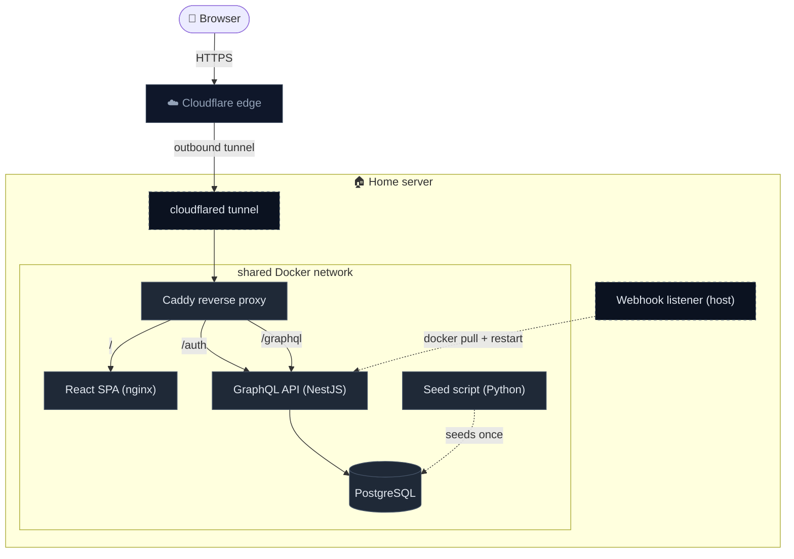

# Medistat

**Personal medication tracking, enriched with Sweden's national prescription statistics.**

[Live dashboard](https://medistat.tiberiusgh.com) · [API playground](https://medistat.tiberiusgh.com/graphql) · [Documentation](https://medistat.tiberiusgh.com/docs/)

---

## What is Medistat?

Medistat lets a person keep a private list of the medications they take and, for each one, see how it sits in the broader Swedish prescribing landscape — regional popularity, age × gender demographics, and multi-year trends. Every insight is derived from open data published by **Socialstyrelsen** (Sweden's National Board of Health and Welfare), spanning every prescription drug dispensed at Swedish pharmacies between 2006 and 2024 — roughly **46 million rows** of national health data, joined with narcotic classifications from **Läkemedelsverket** (Medical Products Agency).

The project is split across four repositories, each with one focused responsibility:

| Repository | Stack | Role |
|---|---|---|
| **[`graphql`](https://github.com/Medistat-Tiberiusgh/graphql)** | NestJS · Apollo Server · PostgreSQL · TypeScript | GraphQL API serving private user data and aggregated public statistics |
| **[`web`](https://github.com/Medistat-Tiberiusgh/web)** | React 19 · Vite · Tailwind v4 · TypeScript | Single-page dashboard with hand-built SVG visualizations |
| **[`db-etl`](https://github.com/Medistat-Tiberiusgh/db-etl)** | Python · uv · Docker · PostgreSQL | ETL pipeline that preprocesses and seeds the prescription dataset |
| **[`docs`](https://github.com/Medistat-Tiberiusgh/docs)** | Docusaurus · Markdown | Public documentation site for API consumers |

---

## Architecture at a glance

The whole stack runs on a single home server behind a **Cloudflare tunnel**. `cloudflared` opens an outbound connection to Cloudflare's edge, so the home network has no inbound ports forwarded — Cloudflare handles TLS and basic edge protection, and everything past the tunnel is plain HTTP.

Caddy fans inbound traffic out by path:

| Path | Routed to | What it is |
|---|---|---|
| `/` | React SPA (nginx) | The dashboard |
| `/auth` | GraphQL API | REST endpoint for the OIDC login exchange |
| `/graphql` | GraphQL API | Schema + playground + every authenticated query/mutation |

The API, PostgreSQL, and the one-shot seed script all sit on the same shared Docker network, so the API talks to Postgres by service name. The **webhook listener is not a container** — it is a small daemon installed directly on the host, authenticated with a symmetric `X-Webhook-Token` header. When CI publishes a fresh image, the listener pulls it and restarts the API container; on a failed smoke test it tag-swaps `previous` back to `latest` and restarts again. The host is the right place for it because doing a `docker pull` and `docker compose up -d` from inside a container would mean mounting the host's Docker socket, which would hand any compromise of that container full root on the box.

---

## The repositories

### [`graphql`](https://github.com/Medistat-Tiberiusgh/graphql) — the API

A NestJS application exposing a single `/graphql` endpoint backed by Apollo Server. PostgreSQL is queried directly via `pg` (no ORM) so query shape stays explicit against a 46 M-row fact table. Schema-first via decorators keeps the SDL and the resolvers in lockstep.

**Highlights**

- **Two surfaces in one schema** — public, unauthenticated reference data (drugs, regions, demographics, aggregated insights) and private, JWT-protected `UserMedication` queries and mutations.
- **Lazy nested resolvers** — `UserMedication.drugData` and `UserMedication.insights` are `@ResolveField`s that only run when the client asks for them, so a thin medications query stays cheap.
- **`DrugInsights` wrapper type** — chosen so future insight dimensions (trend, demographics, gender split) can be added as new fields without a breaking schema change.
- **Typed errors** — every domain error is an `AppError extends GraphQLError` with a `code` extension (`BAD_USER_INPUT`, `UNAUTHENTICATED`, `NOT_FOUND`, `CONFLICT`). A global formatter masks anything else as a generic `INTERNAL_SERVER_ERROR` so implementation details never leak.
- **Defence in depth on input** — application-level length and shape checks first, with `CHECK` / `UNIQUE` / foreign key constraints in the database as the second line.
- **Throttled auth surface** — `register`/`login` are rate-limited via `@nestjs/throttler` (5 req/min in production).

[Browse the schema in the playground →](https://medistat.tiberiusgh.com/graphql)

### [`web`](https://github.com/Medistat-Tiberiusgh/web) — the dashboard

A React 19 + TypeScript single-page app built with Vite, styled with Tailwind v4 and HeroUI v3. **No charting library** — every visualization is hand-built with SVG, and `d3-geo` only handles the map projection.

**What it shows**

- **Omni-search command palette** — a single search bar that accepts both drugs and regions, turns matches into filter chips, and reshapes the dashboard around the active selection.
- **KPI cards** — Total Patients, Dispensings per 1,000, and Chronic Use Ratio, each with year-over-year deltas and comparison against the national average.
- **Dispensing trend chart** — national vs regional line chart over 19 years, with a clickable year axis that drives every other chart on the page.
- **Age × gender heatmap** — the highest-signal view for spotting "this drug is mostly prescribed to women in their 50s" at a glance.
- **Choropleth of Sweden** — D3-projected SVG, hover and click linked to a sortable regional ranking list.
- **Gender gap chart** — mirrored bars showing per-1000 dispensing by gender across years.
- **Saved medications sidebar** — keep a working set of drugs to switch between without re-searching.

**Implementation notes**

- Hooks-first state — `useDashboard` is the single source of truth and composes smaller hooks (`useDashboardInsights`, `useDrugInsights`, `useFilters`) so `Dashboard.tsx` stays purely presentational.
- A tiny custom GraphQL client lives in `src/lib/graphql.ts` — no Apollo, no urql.
- Multi-stage Dockerfile: Vite build, then nginx with a custom `nginx.conf` tuned for SPA routing.

[Open the live dashboard →](https://medistat.tiberiusgh.com)

### [`db-etl`](https://github.com/Medistat-Tiberiusgh/db-etl) — the ETL pipeline

A Python pipeline that turns five raw CSVs into a queryable PostgreSQL schema. Built around clean code and SOLID principles, intended to also be readable as a teaching example.

**Design**

- **Chunked reading** — each CSV is streamed in configurable chunks so files larger than available RAM can be processed (the full fact table is ~46 million rows).
- **Composable transforms** — each transform is a pure `DataFrame → DataFrame` function, easy to test and extend.
- **Directory-based loading** — the pipeline scans `DATA_DIR` for `.csv` files and loads each into its own table, so adding a new file requires zero code changes.
- **Context-managed loaders** — `__enter__` / `__exit__` for automatic resource cleanup.
- **Single compose file** — the same `seed` service runs locally and in production via `docker compose run`.

**Preprocessing scripts** (`scripts/`)

- `narcotics_extractor.py` — parses NPL XML product files from Läkemedelsverket and builds an ATC → narcotic-class (II–V) mapping.
- `preprocessing.py` — joins drug names and the narcotic classification into the raw Socialstyrelsen export and produces the four lookup tables.

A **sample dataset** (~2.5 MB vs the full 1.25 GB) ships in `sample/` so the API and tests can be exercised end-to-end in seconds.

### [`docs`](https://github.com/Medistat-Tiberiusgh/docs) — the documentation site

A Docusaurus site published at [medistat.tiberiusgh.com/docs/](https://medistat.tiberiusgh.com/docs/), serving as the front door for API consumers. Sections include:

- **Getting started** — quickstart against the playground and a walkthrough of authentication.
- **Schema** — narrative overview of the schema and a reference page listing every valid `regionId`, `genderId`, and `ageGroupId`.
- **Infrastructure** — server topology, the CI/CD pipeline, and the dataset disclaimer from Socialstyrelsen.
- **Errors** — the standard error envelope and the full table of error codes.
- **Testing** — how the Bruno collection is structured and run.

---

## Dataset

| | |
|---|---|
| **Source** | Socialstyrelsen — Statistikdatabasen, Läkemedel 2006–2024 |
| **Narcotic enrichment** | Läkemedelsverket — NPL (Nationellt produktregister för läkemedel) |
| **Scale** | ~46 million rows in the fact table |
| **Coverage** | All human drugs (7-character ATC codes; veterinary Q-prefix excluded) |
| **Partition** | (year, region, ATC code, gender, age group) |
| **Metrics per row** | `num_prescriptions`, `num_patients`, `per_1000` inhabitants |

> **Disclaimer (paraphrased from Socialstyrelsen).** The data covers prescriptions dispensed at pharmacies only — over-the-counter and inpatient/outpatient drugs are not included. Patient counts are not additive across ATC codes (the same patient may appear in several). "Dispensings" are not the same as "prescriptions" — a single prescription can result in multiple dispensings, and dose-dispensed packages inflate dispensing counts further. The latest ATC version is always applied retroactively across history. Region is the patient's registered address at the time of dispensing; age is `year of dispensing − year of birth`.

---

## Authentication

The API delegates identity to **GitHub via OAuth 2.0 with PKCE** (RFC 7636, `S256`), then issues its own session token as a JWT signed with HS256.

1. The frontend generates a cryptographically random `code_verifier`, derives a SHA-256 `code_challenge`, and stores the verifier in `sessionStorage`.
2. The user is redirected to GitHub's authorization endpoint with the challenge attached.
3. GitHub returns an authorization `code` to the frontend.
4. The frontend POSTs `{ code, codeVerifier, redirectUri }` to `POST /auth/github/exchange`. The backend completes the token exchange with GitHub (including the verifier), upserts the user record, and returns a JWT.

**Why PKCE.** It defeats two distinct attacks: OAuth login CSRF (attacker tricks a victim into completing a flow with the attacker's code) and authorization code interception. The verifier never leaves the browser that started the flow, so a code redeemed without it is rejected.

**Why a JWT.** Stateless verification — any API instance can validate a token without consulting a shared session store, which keeps horizontal scaling cheap. The trade-off is no instant invalidation without a blocklist.

**Why delegate identity.** Authentication is security-critical and easy to misconfigure. Offloading password storage, credential rotation, and account recovery to GitHub leaves the API to handle only authorization. The trade-off is that all users need a GitHub account.

A custom `JwtAuthGuard` validates the token on every protected query/mutation, and a `@CurrentUser()` parameter decorator exposes the decoded payload inside resolvers.

---

## Infrastructure & deployment

### Production topology

The stack lives on a self-hosted home server, reached from the public internet through a **Cloudflare tunnel** (`cloudflared`). The tunnel opens outbound from the home network to Cloudflare's edge, so the router has no inbound ports forwarded — Cloudflare handles TLS and edge protection, and everything past the tunnel is plain HTTP.

**On the host**

| Service | Role |
|---|---|
| **cloudflared** | Outbound tunnel daemon — terminates the Cloudflare side of the connection on the home network |
| **Webhook listener** | Small host-installed daemon, authenticated with a symmetric `X-Webhook-Token`. Pulls fresh images and runs `docker compose up -d` on deploy / rollback. Lives on the host (rather than in a container) so it never needs the Docker socket mounted into a network-exposed container. |

**On the shared Docker network**

| Container | Role |
|---|---|
| **Caddy** | Reverse proxy — fans traffic out by path: `/` → SPA, `/auth` → API (OIDC login), `/graphql` → API |
| **React SPA (nginx)** | Static Vite build served from nginx |
| **GraphQL API** | NestJS + Apollo Server |
| **PostgreSQL** | Prescription dataset and user data |
| **Seed script** | Python ETL that loads the dataset into Postgres on first boot |

The API reaches Postgres by service name on the shared network. Nothing on the public internet ever talks to the home server directly — every request comes in through the Cloudflare tunnel.

### CI/CD pipeline (GitHub Actions)

Every push to `main` of the API repo triggers four jobs:

1. **Build & push image** — `docker/build-push-action` builds the image and pushes it to **GHCR** (`ghcr.io`), tagged with both the short commit SHA and `latest`, with metadata extracted via `docker/metadata-action`.
2. **Deploy** — `curl -X POST` against the deploy webhook on the home server, authenticated with `X-Webhook-Token`. The host-side listener pulls `latest` and restarts the API container.
3. **Smoke test** — the Bruno CLI runs the full collection against the live production API at `https://medistat.tiberiusgh.com`. A short sleep gives the new container time to come up first.
4. **Rollback** — runs only `if: failure()` after smoke test. A second webhook tells the host to swap `previous` back to `latest` and restart. Recovery is as fast as a container reboot — no registry pull is needed because the previous image is still on disk.

The webhook URLs and the symmetric token live in GitHub repository secrets and never appear in logs or in the repository. The frontend repo has the same shape minus the smoke-test/rollback stages.

---

## Testing

API tests are written as a **[Bruno](https://www.usebruno.com/) collection** stored as plain YAML files alongside the code. Bruno was chosen over Postman because Postman cannot export GraphQL collections as files, which makes version control and CI integration impractical.

The collection runs in four sequenced phases:

| Folder | Sequence | Description |
|---|---|---|
| `Auth` | 1 | Register, login, and authentication error cases |
| `Queries` | 2 | Read-only queries for all reference data and statistics |
| `Medications` | 3 | Full medication lifecycle (add, update, fetch, remove) |
| `Cleanup` | 99 | Deletes the test user created during the run |

Because every run is bookended by a unique `test_<timestamp>` user and a cleanup step, the suite is **safe to run against the production API** — which is exactly what the smoke-test stage does after every deploy.

---

## Tech stack summary

| Layer | Choice | Why |
|---|---|---|
| API framework | **NestJS** | Opinionated module structure that enforces dependency inversion by design |
| GraphQL server | **Apollo Server** | Mature ecosystem, integrates cleanly with NestJS via decorators |
| Database | **PostgreSQL** | Clear relational structure in the dataset; handles the data volume well |
| DB driver | **`pg` (raw SQL)** | Full control over query shape against a 46 M-row table; no risk of an ORM generating opaque, inefficient queries |
| Frontend framework | **React 19 + Vite** | Modern hooks-first composition; Vite for fast dev/build |
| Styling | **Tailwind v4 + HeroUI v3** | Utility-first styling, ready-made accessible primitives |
| Visualizations | **Hand-rolled SVG + `d3-geo`** | Full control over the visual language; no chart-library lock-in |
| ETL | **Python + uv** | Best-in-class for chunked CSV processing on a multi-GB dataset |
| Reverse proxy | **Caddy** | Automatic TLS via Let's Encrypt, simple config |
| CI/CD | **GitHub Actions + GHCR + webhooks** | Hosted runners build & push the image; a host-installed webhook listener does the deploy, so CI never needs SSH to the server |
| API tests | **Bruno** | Plain-file collections that version-control cleanly and run in CI |
| Docs site | **Docusaurus** | Markdown-driven, easy to host as static content alongside the API |

---

## Course context

Medistat was built as the final assignment for **1DV027 — API Design** at **Linnaeus University (LNU)**. The course required designing a GraphQL or REST API around an open dataset, with a primary CRUD resource, secondary read-only resources, authentication, automated tests, CI/CD, and a deployed production environment. Medistat extends that brief with a hand-built React dashboard and a Docusaurus documentation site so the API has an end-to-end consumer story.

---

## Acknowledgements

- **Socialstyrelsen** — for the open prescription statistics dataset
- **Läkemedelsverket** — for the NPL data used to enrich drugs with narcotic classification
- **Sveriges län (dataportal.se)** — for the region geometry powering the choropleth
- **RxNav** and **MedlinePlus** — for the substance information shown in the drug info card
- **Linnaeus University** — for the 1DV027 course brief, infrastructure, and the staff who supported the project
- **NestJS, Apollo, Docusaurus, HeroUI, d3, Bruno** — for the open-source foundations that made this scope feasible for one student over one term
